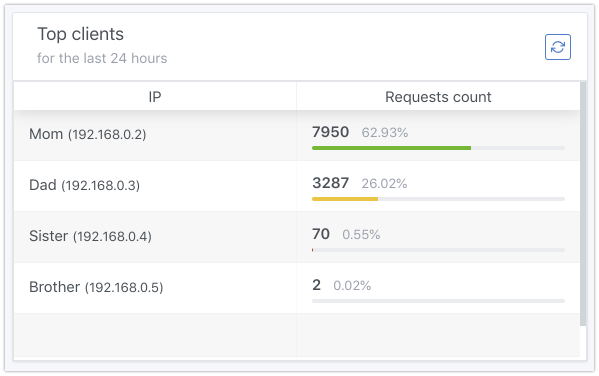
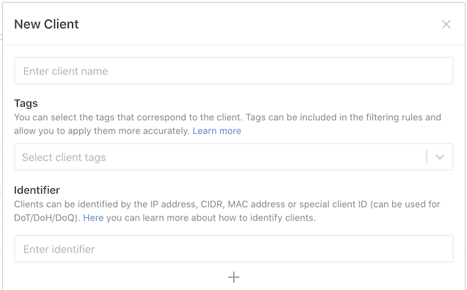
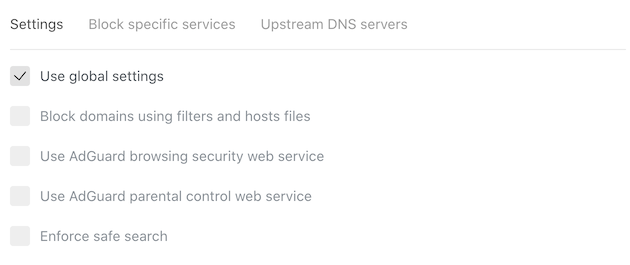

 #  AdGuard Home - Configuring Clients

AdGuard Home allows flexible configuration for devices that are connected to it.
On a basic level, you may just want to be able to distinguish them and see
friendly names instead of naked IP addresses.  Additionally, AdGuard Home allows
you applying different rules depending on the client.

 *  [Friendly Names](#friendlynames)
 *  [Persistent Clients](#newclient)
     *  [Identifying clients](#idclient)
     *  [Settings](#clientsettings)
 *  [Per-Client Blocking](#perclientblocking)

##  <a href="#friendlynames" id="friendlynames" name="friendlynames">Friendly Names</a>

AdGuard Home tries to automatically collect some basic information about the
device that's connecting to it.

Here is what it tries to do in order to figure out the client's hostname:

1.  inspects the hosts files (for example, `/etc/hosts`) and uses hostnames
    found there to identify clients;

1.  makes reverse DNS lookups;

1.  inspects the system ARP table;

1.  for public IP addresses it also makes [WHOIS][whois] queries in order to
    find out the client's location and the company the IP belongs to;

1.  for IP addresses leased by AdGuard Home's DHCP server it obtains the
    hostname from leases.

If the only thing you need is to see friendly names in AdGuard Home stats then
editing the hosts file may be the easiest way to achieve this.  Please note that
you may need to restart AdGuard Home to apply the changes.

Since **v0.107.7** runtime clients sources can be disabled via the
[`clients.runtime_sources`][sources] object of the configuration file.

[whois]:   https://en.wikipedia.org/wiki/WHOIS
[sources]: https://github.com/AdguardTeam/AdGuardHome/wiki/Configuration#configuration-file

##  <a href="#newclient" id="newclient" name="newclient">Persistent Clients</a>

If you want more than just to see the client names, you may want to configure
each client manually.  If that's the case, head to the “Settings → Clients
settings” page and click the "Add client" button there.

   ###  <a href="#idclient" id="idclient" name="idclient">Identifying clients</a>

First of all, you need to decide how you would like to identify the client.
There are several options to do this.

1.  **IP address.**  For instance, `192.168.0.1`. This is the easiest way to do
    this, but it may be not good enough if the IP address changes too often.

1.  **CIDR range.**  For instance, `192.168.0.1/24`. Allows attributing a whole
    range of IP addresses (in the example it is `192.168.0.*`) to the same
    client.

1.  **MAC address.**  Using MAC as a client identifier is **only** possible when
    AdGuard Home works as the network's [DHCP server](DHCP).

1.  **ClientIDs.**  Special identifiers that can be used with some encrypted DNS
    protocols.  [See below](#clientid).

  ####  <a href="#clientid" id="clientid" name="clientid">ClientID</a>

ClientIDs are identifiers that can be used with the following DNS protocols:
DNS-over-HTTPS, DNS-over-TLS, and DNS-over-QUIC.  To use this identifier,
clients should perform queries using a special domain name or URL.  For example:

 *  AdGuard Home has the domain name `example.org`.

 *  In AdGuard Home you add a persistent client with the ClientID `my-client`.

 *  On the client device you can now configure:

     *  **DNS-over-HTTPS:** `https://example.org/dns-query/my-client`.

        Since **v0.108.0-b.18:** `https://my-client.example.org/dns-query`
        (requires a [wildcard certificate][wild]).  **NOTE:**  The URL ClientID
        has higher priority than the server-name ClientID.  If you use both,
        only the URL ClientID is used.

     *  **DNS-over-QUIC:** `quic://my-client.example.org` (requires a [wildcard
        certificate][wild]).

     *  **DNS-over-TLS:** `tls://my-client.example.org` (requires a [wildcard
        certificate][wild]).

Note that the TLS certificate must be valid **both** for `*.example.org` **and**
`example.org`.

[wild]: https://en.wikipedia.org/wiki/Wildcard_certificate

   ###  <a href="#clientsettings" id="clientsettings" name="clientsettings">Settings</a>

Each client can be configured individually.  You may choose what to block, what
settings should be used, or you could even configure a completely different set
of upstream DNS servers to be used for this client.

##  <a href="#perclientblocking" id="perclientblocking" name="perclientblocking">Per-Client Blocking</a>

There are two ways of how you can configure blocking on the per-client basis.
Both of them are based on using AdGuard blocklist rules syntax for the rules
you're adding to "Custom filtering rules".

   ###  `client` rules

The first one is using the `client` modifier.  This way you can limit the rule
to a particular client or clients.

Examples:

 *  `@@||*^$client=127.0.0.1`: Unblock everything for localhost.

 *  `||example.org^$client='Frank\'s laptop'`: Block `example.org` for the
    client named `Frank's laptop` only.  Note that quote (`'`) in the name must
    be escaped.

 *  `||example.org^$client=192.168.0.0/24`: Block `example.org` for all clients
    with the IP addresses in the range `192.168.0.0-192.168.0.255`.

You can find more `client` examples in the [article](Hosts-Blocklists#client)
about the filtering rules syntax.

   ###  `ctag` rules

The second way is to use another modifier called `ctag`.  When you create a new
client, tags can be assigned to it.  These tags can then be used in the
filtering rules.

Examples:

 *  `||example.org^$ctag=device_pc|device_phone`: Block `example.org` for
    clients tagged as `device_pc` or `device_phone`.

 *  `||example.org^$ctag=~device_phone`: Block `example.org` for all clients
    except those tagged as `device_phone`.

You can find more `ctag` examples as well as the full list of tags in the
[article](Hosts-Blocklists#ctag) about the filtering rules syntax.
