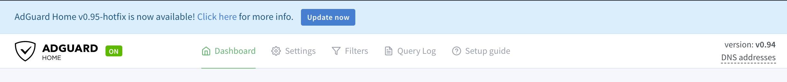

# AdGuard Home - Getting Started

In order to start using AdGuard Home, you need to do a few things:

1. [Installation](#installation)
2. [Running for the first time](#first-time)
3. [Running as a service](#service)
4. [How to update](#update)
5. [Configure your devices](#configure-devices)
6. [Running without superuser (linux only)](#running-without-superuser)
7. [Limitations](#limitations)

<a id="installation"></a>
## Installation

Download the archive with the binary file for your operating system from the [latest stable release](https://github.com/AdguardTeam/AdGuardHome/releases/latest).

We currently **officially** support the following operating systems:

* Linux: [64-bit](https://static.adguard.com/adguardhome/release/AdGuardHome_linux_amd64.tar.gz), [32-bit](https://static.adguard.com/adguardhome/release/AdGuardHome_linux_386.tar.gz)
* Linux ARM: [32-bit ARMv6](https://static.adguard.com/adguardhome/release/AdGuardHome_linux_armv6.tar.gz) (recommended for Rapsberry Pi), [64-bit](https://static.adguard.com/adguardhome/release/AdGuardHome_linux_arm64.tar.gz), [32-bit ARMv5](https://static.adguard.com/adguardhome/release/AdGuardHome_linux_armv5.tar.gz), [32-bit ARMv7](https://static.adguard.com/adguardhome/release/AdGuardHome_linux_armv7.tar.gz)
* Linux MIPS: [32-bit MIPS](https://static.adguard.com/adguardhome/release/AdGuardHome_linux_mips_softfloat.tar.gz), [32-bit MIPSLE](https://static.adguard.com/adguardhome/release/AdGuardHome_linux_mipsle_softfloat.tar.gz), [64-bit MIPS](https://static.adguard.com/adguardhome/release/AdGuardHome_linux_mips64_softfloat.tar.gz), [64-bit MIPSLE](https://static.adguard.com/adguardhome/release/AdGuardHome_linux_mips64le_softfloat.tar.gz)
* Windows: [64-bit](https://static.adguard.com/adguardhome/release/AdGuardHome_windows_amd64.zip), [32-bit](https://static.adguard.com/adguardhome/release/AdGuardHome_windows_386.zip)
* MacOS: [64-bit](https://static.adguard.com/adguardhome/release/AdGuardHome_darwin_amd64.zip), [32-bit](https://static.adguard.com/adguardhome/release/AdGuardHome_darwin_386.zip)
* FreeBSD: [64-bit](https://static.adguard.com/adguardhome/release/AdGuardHome_freebsd_amd64.tar.gz), [32-bit](https://static.adguard.com/adguardhome/release/AdGuardHome_freebsd_386.tar.gz)
* FreeBSD ARM: [64-bit](https://static.adguard.com/adguardhome/release/AdGuardHome_freebsd_arm64.tar.gz), [32-bit ARMv5](https://static.adguard.com/adguardhome/release/AdGuardHome_freebsd_armv5.tar.gz), [32-bit ARMv6](https://static.adguard.com/adguardhome/release/AdGuardHome_freebsd_armv6.tar.gz), [32-bit ARMv7](https://static.adguard.com/adguardhome/release/AdGuardHome_freebsd_armv7.tar.gz)

> **MacOS 10.15 Catalina** or newer: please note, that on MacOS Catalina it is recommended to place AdGuard Home directory to the "Applications" directory.

> AdGuard Home can work on other operating systems as well (for instance, it can work on devices with MIPS CPU), but we need your help with testing it.

Other options:

* [AdGuard Home docker image](https://hub.docker.com/r/adguard/adguardhome)
* You can get AdGuard Home from the [Snap Store](https://snapcraft.io/adguard-home) (Linux App Store)
* (Unofficial) [AdGuardHome in Entware repository](http://bin.entware.net/mipselsf-k3.4/test/)


<a id="first-time"></a>
## Running for the first time

DNS works on port 53, which requires superuser privileges. Therefore, you need to run it with `sudo` in terminal:

```bash
sudo ./AdGuardHome
```

> On Windows, you will need to run `cmd.exe` with admin privileges and run `AdGuardHome.exe` from there.

When you run AdGuard Home for the first time, it will start listening to `0.0.0.0:3000` and prompt you to open it in your browser:

```
AdGuard Home is available on the following addresses:
Go to http://127.0.0.1:3000
Go to http://X.X.X.X:3000
```

There you will go through the initial configuration wizard.


<a id="service"></a>
## Running as a service

The next step would be to register AdGuard Home as a system service on Windows, Linux/(systemd | Upstart | SysV), or OSX/Launchd.

Run `sudo ./AdGuardHome -s install` to install AdGuard Home as a system service.

> On Windows run `cmd.exe` with admin privileges and run `AdGuardHome.exe -s install` to register a windows service.

Here are the other commands you might need to control the service.

* `AdGuardHome -s uninstall` - uninstalls the AdGuard Home service.
* `AdGuardHome -s start` - starts the service.
* `AdGuardHome -s stop` - stops the service.
* `AdGuardHome -s restart` - restarts the service.
* `AdGuardHome -s status` - shows the current service status.

> ### Logs
> By default, the log is written to stderr when you run AdGuard Home as a console application.
> 
> If you run it as a service/daemon, the log output depends on the platform:
> 
> * Linux: the log is written to syslog.
> * MacOS: the log is written to /var/log/AdGuardHome.*.log files.
> * Windows: the log is written to the Windows event log.
>
> You can redefine this behavior in the AdGuard Home [configuration file](Configuration).

<a id="update"></a>
## How to update



When a new version is released, AdGuard Home's UI shows a notification message and 'Update Now' button. Simply click on this button and AdGuard Home will be automatically upgraded to the latest version. Your current AdGuard Home executable file is saved inside 'backup' directory along with the current configuration file, so you can revert the changes, if necessary.

In case the button isn't shown or an automatic update has failed, you can upgrade manually:

1. Download the new AdGuard Home package.
2. Unpack it to a temporary directory.
3. Replace the old AdGuard Home executable file with the new one.
4. Restart AdGuard Home.

### Docker and Hass.io updates

Auto-updates for Docker and Hass.io are disabled.


<a id="configure-devices"></a>
## How to configure your devices

### Router

This setup will automatically cover all the devices connected to your home router, and you will not need to configure each of them manually.

1. Open the preferences for your router. Usually, you can access it from your browser via a URL (like http://192.168.0.1/ or http://192.168.1.1/). You may be asked to enter the password. If you don’t remember it, you can often reset the password by pressing a button on the router itself. Some routers require a specific application, which in that case should be already installed on your computer/phone.
2. Find the DHCP/DNS settings. Look for the ’DNS’ letters next to a field which allows two or three sets of numbers, each broken into four groups of one to three digits.
3. Enter your AdGuard Home server addresses there.

### Android

1. From the Android Menu home screen, tap ’Settings’
2. Tap Wi-Fi on the menu. This will show a list of all of the available networks (it is impossible to set custom DNS for mobile connection)
3. Long press the network you’re connected to, and tap ’Modify Network’
4. On some devices, you may need to check the box for ’Advanced’ to see further settings. To adjust your Android DNS settings, you will need to switch the IP settings from ’DHCP’ to ’Static.’
5. Change ’DNS 1′ and ’DNS 2′ values to your AdGuard Home address.

### iOS

1. From the home screen, tap ’Settings’
2. Choose ’Wi-Fi’ in the left menu (it is impossible to configure DNS for mobile networks)
3. Tap on the name of the currently active network
4. In the ’DNS’ field enter your AdGuard Home address

### macOS

1. Click on Apple icon and go to ’System Preferences.’
2. Click on ’Network’
3. Select the first connection in your list and click ’Advanced.’
4. Select the ’DNS’ tab and add the address of your AdGuard Home.

### Windows

1. Open Control Panel through ’Start’ menu or Windows search.
2. Go to ’Network and Internet’ category and then to ’Network and Sharing Center.’
3. On the left side of the screen find ’Change adapter settings’ and click on it.
4. Select your active connection, right-click on it and choose ’Properties.’
5. Find ’Internet Protocol Version 4 (TCP/IP)’ in the list, select it and then click on ’Properties’ again.
5. Choose ’Use the following DNS server addresses’ and enter your AdGuard Home address there.

<a id="running-without-superuser"></a>
## Running without superuser (linux only)

You can run AdGuard Home without superuser privileges, but you need to either grant the binary a capability (on Linux) or instruct it to use a different port (all platforms).

#### Granting the CAP_NET_BIND_SERVICE capability (on Linux)

Note: using this method requires the `setcap` utility.  You may need to install it using your Linux distribution's package manager.

To allow AdGuard Home running on Linux to listen on port 53 without superuser privileges, run:

```bash
sudo setcap CAP_NET_BIND_SERVICE=+eip ./AdGuardHome
```

Then run `./AdGuardHome` as a unprivileged user.

#### Changing the DNS listen port

To configure AdGuard Home to listen on a port that does not require superuser privileges, edit `AdGuardHome.yaml` and find these two lines:

```yaml
dns:
  port: 53
```

You can change port 53 to anything above 1024 to avoid requiring superuser privileges.

If the file does not exist, create it in the same folder, type these two lines down and save.


<a id="limitations"></a>
## Limitations

### Doesn't work on some file systems

Some file systems don't support `mmap()` system call that Statistics module requires (more details here: https://github.com/AdguardTeam/AdGuardHome/issues/1188).

You can resolve this issue:

* by supplying `--work-dir DIRECTORY` arguments to `AdGuardHome` binary.  This option will tell AGH to use another directory for all its files (by default it's set to `./data`).

* or you can create symbolic links pointing to another file system that supports `mmap()` (e.g. tmpfs):

  ```
  ln -s <YOUR_AGH_PATH>/data/stats.db /tmp/stats.db
  ln -s <YOUR_AGH_PATH>/data/sessions.db /tmp/sessions.db
  ```
