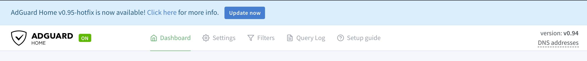

 #  AdGuard Home - Getting Started

1.  [Installation](#installation)
1.  [First Start](#first-time)
1.  [Running As A Service](#service)
1.  [Updating](#update)
1.  [Configuring Devices](#configure-devices)
1.  [Running Without Superuser (Linux Only)](#running-without-superuser)
1.  [Limitations](#limitations)


##  <a href="#installation" id="installation" name="installation">Installation</a>

Download the archive with the binary file for your operating system from the
[latest stable release page][releases].

We currently **officially** support the following operating systems:

 *  Linux:

    **Fedora** and its derivatives: install AdGuard Home into the
    `/usr/local/bin` directory.  Otherwise it may cause issues with SELinux and
    permissions.  See [issue 765] and [issue 3281].

     *  [AMD64](https://static.adguard.com/adguardhome/release/AdGuardHome_linux_amd64.tar.gz);
     *  [x86](https://static.adguard.com/adguardhome/release/AdGuardHome_linux_386.tar.gz);
     *  [64-bit ARM](https://static.adguard.com/adguardhome/release/AdGuardHome_linux_arm64.tar.gz);
     *  [32-bit ARMv5](https://static.adguard.com/adguardhome/release/AdGuardHome_linux_armv5.tar.gz);
     *  [32-bit ARMv6](https://static.adguard.com/adguardhome/release/AdGuardHome_linux_armv6.tar.gz) (recommended for Raspberry Pi);
     *  [32-bit ARMv7](https://static.adguard.com/adguardhome/release/AdGuardHome_linux_armv7.tar.gz);
     *  [64-bit MIPS](https://static.adguard.com/adguardhome/release/AdGuardHome_linux_mips64_softfloat.tar.gz);
     *  [64-bit MIPS LE](https://static.adguard.com/adguardhome/release/AdGuardHome_linux_mips64le_softfloat.tar.gz);
     *  [32-bit MIPS](https://static.adguard.com/adguardhome/release/AdGuardHome_linux_mips_softfloat.tar.gz);
     *  [32-bit MIPS LE](https://static.adguard.com/adguardhome/release/AdGuardHome_linux_mipsle_softfloat.tar.gz);
     *  [64-bit PowerPC LE](https://static.adguard.com/adguardhome/release/AdGuardHome_linux_ppc64le.tar.gz);

 *  Windows:

     *  [AMD64](https://static.adguard.com/adguardhome/release/AdGuardHome_windows_amd64.zip);
     *  [x86](https://static.adguard.com/adguardhome/release/AdGuardHome_windows_386.zip).

 *  MacOS:

    **MacOS 10.15 Catalina** or newer: please note, that on MacOS Catalina it is
    recommended to place AdGuard Home directory to the `/Applications`
    directory.

     *  [AMD64](https://static.adguard.com/adguardhome/release/AdGuardHome_darwin_amd64.zip);
     *  [64-bit ARM](https://static.adguard.com/adguardhome/release/AdGuardHome_darwin_arm64.zip).

 *  FreeBSD:

     *  [AMD64](https://static.adguard.com/adguardhome/release/AdGuardHome_freebsd_amd64.tar.gz);
     *  [x86](https://static.adguard.com/adguardhome/release/AdGuardHome_freebsd_386.tar.gz);
     *  [64-bit ARM](https://static.adguard.com/adguardhome/release/AdGuardHome_freebsd_arm64.tar.gz);
     *  [32-bit ARMv5](https://static.adguard.com/adguardhome/release/AdGuardHome_freebsd_armv5.tar.gz);
     *  [32-bit ARMv6](https://static.adguard.com/adguardhome/release/AdGuardHome_freebsd_armv6.tar.gz);
     *  [32-bit ARMv7](https://static.adguard.com/adguardhome/release/AdGuardHome_freebsd_armv7.tar.gz).

 *  OpenBSD:

     *  [AMD64](https://static.adguard.com/adguardhome/release/AdGuardHome_openbsd_amd64.tar.gz);
     *  [64-bit ARM](https://static.adguard.com/adguardhome/release/AdGuardHome_openbsd_arm64.tar.gz);

Other official options:

 *  [AdGuard Home docker image][docker].

 *  You can get AdGuard Home from the [Snap Store][snap] (an app store for
    Ubuntu and relates OSes).

Other unofficial options:

 *  (Maintained by @frenck) [Home Assistant add-on][has].

 *  (Maintained by @kongfl888) [OpenWrt LUCI app][luci].

 *  (Maintained by @graysky2) [Arch Linux][arch], [Arch Linux ARM][archarm], and
    other Arch-based OSes, may build via the [`adguardhome` package][aghaur] in
    the [AUR][aur].

 *  (Maintained by @gramakri) [Cloudron app][cloudron].

[aghaur]:     https://aur.archlinux.org/packages/adguardhome/
[arch]:       https://www.archlinux.org/
[archarm]:    https://archlinuxarm.org/
[aur]:        https://wiki.archlinux.org/index.php/Arch_User_Repository
[cloudron]:   https://git.cloudron.io/cloudron/adguard-home-app
[docker]:     https://hub.docker.com/r/adguard/adguardhome
[has]:        https://github.com/hassio-addons/addon-adguard-home
[issue 3281]: https://github.com/AdguardTeam/AdGuardHome/issues/3281
[issue 765]:  https://github.com/AdguardTeam/AdGuardHome/issues/765#issuecomment-752262353
[luci]:       https://github.com/kongfl888/luci-app-adguardhome
[releases]:   https://github.com/AdguardTeam/AdGuardHome/releases/latest
[snap]:       https://snapcraft.io/adguard-home


##  <a href="#first-time" id="first-time" name="first-time">First Start</a>

DNS servers bind to port 53, which requires superuser privileges most of the
time ([see below](#running-without-superuser).  Therefore, on unix systems you
need to run it with `sudo` or `doas` in terminal:

```sh
sudo ./AdGuardHome
```

On Windows, run `cmd.exe` with admin privileges and run `AdGuardHome.exe` from
there.

When you run AdGuard Home for the first time, it starts listening to
`0.0.0.0:3000` and prompts you to open it in your browser:

```
AdGuard Home is available on the following addresses:
Go to http://127.0.0.1:3000
Go to http://X.X.X.X:3000
```

There you will go through the initial configuration wizard.


##  <a href="#service" id="service" name="service">Running As A Service</a>

The next step would be to register AdGuard Home as a system service (aka
daemon).  To install AdGuard Home as a service, run:

```sh
sudo ./AdGuardHome -s install
```

On Windows, run `cmd.exe` with admin privileges and run `AdGuardHome.exe -s
install` to register a windows service.

Here are the other commands you might need to control the service:

 *  `AdGuardHome -s uninstall`: Uninstall the AdGuard Home service.
 *  `AdGuardHome -s start`: Start the service.
 *  `AdGuardHome -s stop`: Stop the service.
 *  `AdGuardHome -s restart`: Restart the service.
 *  `AdGuardHome -s status`: Show the current service status.

   ###  Logs

By default, the log is written to stderr when you run AdGuard Home as a console
application.  If you run it as a service, the log output depends on the
platform:

 *  On MacOS, the log is written to `/var/log/AdGuardHome.*.log` files.

 *  On other unixes, the log is written to `syslog` or `journald`.

 *  On Windows, the log is written to the Windows event log.

You can change this behavior in the AdGuard Home [configuration
file](Configuration).


##  <a href="#update" id="update" name="update">Updating</a>



When a new version is released, AdGuard Home's UI shows a notification message
and the “Update Now” button.  Just click on this button, and AdGuard Home will
be automatically upgraded to the latest version.  Your current AdGuard Home
executable file is saved inside the `backup` directory along with the current
configuration file, so you can revert the changes, if necessary.

In case the button isn't shown or an automatic update has failed, you can
upgrade manually:

1. Download the new AdGuard Home package.

1. Unpack it to a temporary directory.

1. Replace the old AdGuard Home executable file with the new one.

1. Restart AdGuard Home.


   ###  Docker And Hass.io Updates

Auto-updates for Docker and Hass.io installations are disabled.


##  <a href="#configure-devices" id="configure-devices" name="configure-devices">Configuring Devices</a>

   ###  Router

This setup will automatically cover all devices connected to your home router,
and you won't need to configure each of them manually.

1.  Open the preferences for your router. Usually, you can access it from your
    browser via a URL, such as <http://192.168.0.1/> or <http://192.168.1.1/>.
    You may be prompted to enter a password.  If you don't remember it, you can
    often reset the password by pressing a button on the router itself, but be
    aware that if this procedure is chosen, you will probably lose the entire
    router configuration.  If your router requires an app to set it up, please
    install the app on your phone or PC and use it to access the router’s
    settings.

1.  Find the DHCP/DNS settings. Look for the DNS letters next to a field which
    allows two or three sets of numbers, each broken into four groups of one to
    three digits.

1.  Enter your AdGuard Home server addresses there.

1.  On some router types, a custom DNS server cannot be set up. In that case,
    setting up AdGuard Home as a DHCP server may help. Otherwise, you should
    check the router manual on how to customize DNS servers on your specific
    router model.


   ###  Windows

1.  Open Control Panel through Start menu or Windows search.

1.  Go to Network and Internet category and then to Network and Sharing Center.

1.  On the left side of the screen find “Change adapter settings” and click on
    it.

1.  Select your active connection, right-click on it and choose Properties.

1.  Find “Internet Protocol Version 4 (TCP/IPv4)” (or, for IPv6, “Internet
    Protocol Version 6 (TCP/IPv6)”) in the list, select it and then click on
    Properties again.

1.  Choose “Use the following DNS server addresses” and enter your AdGuard Home
    server addresses.


   ###  macOS

1.  Click on Apple icon and go to System Preferences.

1.  Click on Network.

1.  Select the first connection in your list and click Advanced.

1.  Select the DNS tab and enter your AdGuard Home server addresses.


   ###  Android

1.  From the Android Menu home screen, tap Settings.

1.  Tap Wi-Fi on the menu.  The screen listing all of the available networks
    will be shown (it is impossible to set custom DNS for mobile connection).

1.  Long press the network you're connected to and tap Modify Network.

1.  On some devices, you may need to check the box for Advanced to see further
    settings.  To adjust your Android DNS settings, you will need to switch the
    IP settings from DHCP to Static.

1.  Change set DNS 1 and DNS 2 values to your AdGuard Home server addresses.


   ###  iOS

1.  From the home screen, tap Settings.

1.  Choose Wi-Fi in the left menu (it is impossible to configure DNS for mobile
    networks).

1.  Tap on the name of the currently active network.

1.  In the DNS field enter your AdGuard Home server addresses.


##  <a href="#running-without-superuser" id="running-without-superuser" name="running-without-superuser">Running Without Superuser (Linux Only)</a>

You can run AdGuard Home without superuser privileges, but you need to either
grant the binary a capability (on Linux) or instruct it to use a different port
(all platforms).

   ###  Granting The Necessary Capabilities

Using this method requires the `setcap` utility.  You may need to install it
using your Linux distribution's package manager.

To allow AdGuard Home running on Linux to listen on port 53 without superuser
privileges, as well as bind to a particular interface run:

```bash
sudo setcap 'CAP_NET_BIND_SERVICE=+eip CAP_NET_RAW=+eip' ./AdGuardHome
```

Then run `./AdGuardHome` as a unprivileged user.


  ###  Changing The DNS Listen Port

To configure AdGuard Home to listen on a port that does not require superuser
privileges, stop AdGuard Home, open `AdGuardHome.yaml` in your editor, and find
these lines:

```yaml
dns:
  port: 53
```

You can change the port to anything above 1024 to avoid requiring superuser
privileges.  If the file does not exist, create it in the same folder, type
these two lines down and save.


##  <a href="#limitations" id="limitations" name="limitations">Limitations</a>

Some file systems don't support the `mmap(2)` system call that the statistics
system requires.  See also [issue 1188].

You can resolve this issue:

* either by supplying the `--work-dir DIRECTORY` arguments to `AdGuardHome`
  binary.  This option will tell AGH to use another directory for all its files
  instead of the default `./data` directory.

* or by creating symbolic links pointing to another file system that supports
  `mmap(2)` (e.g. tmpfs):

  ```sh
  ln -s ${YOUR_AGH_PATH}/data/stats.db /tmp/stats.db
  ln -s ${YOUR_AGH_PATH}/data/sessions.db /tmp/sessions.db
  ```

[issue 1188]: https://github.com/AdguardTeam/AdGuardHome/issues/1188
